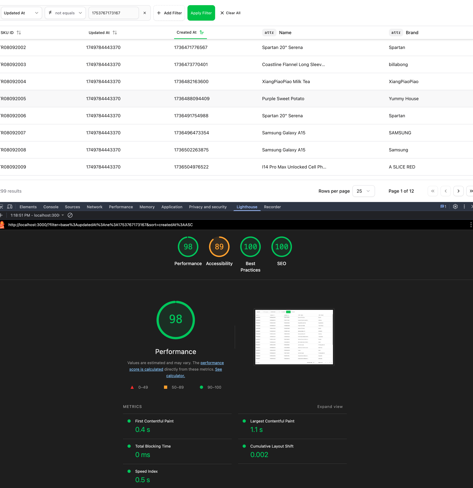

## Observability & Testing

### Sentry

- For this project, I've used Sentry to track errors and performance. also it's free. Otherwise I would use Datadog.
- 
- home path is doing decent.

### Basic lighthouse report

- 
- not really a good report, but it's a good starting point.

### Analytics

- User tracking can be done with analytics util, we can use this module so that we can use multiple different analytics providers.
- And further tracking can be done with `useAnalytics` hook.
- further reading : https://www.npmjs.com/package/use-analytics
